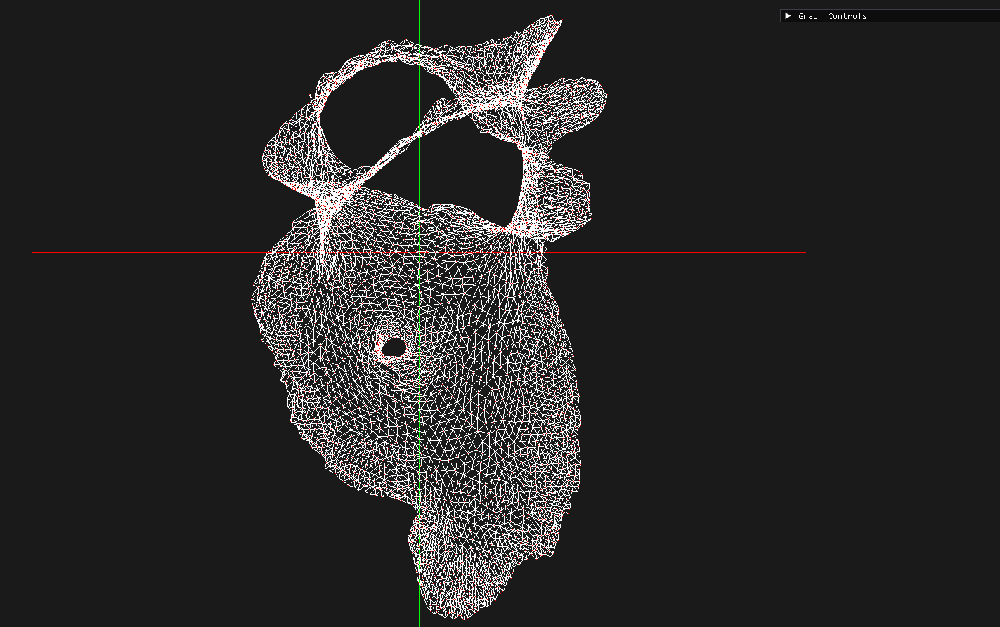
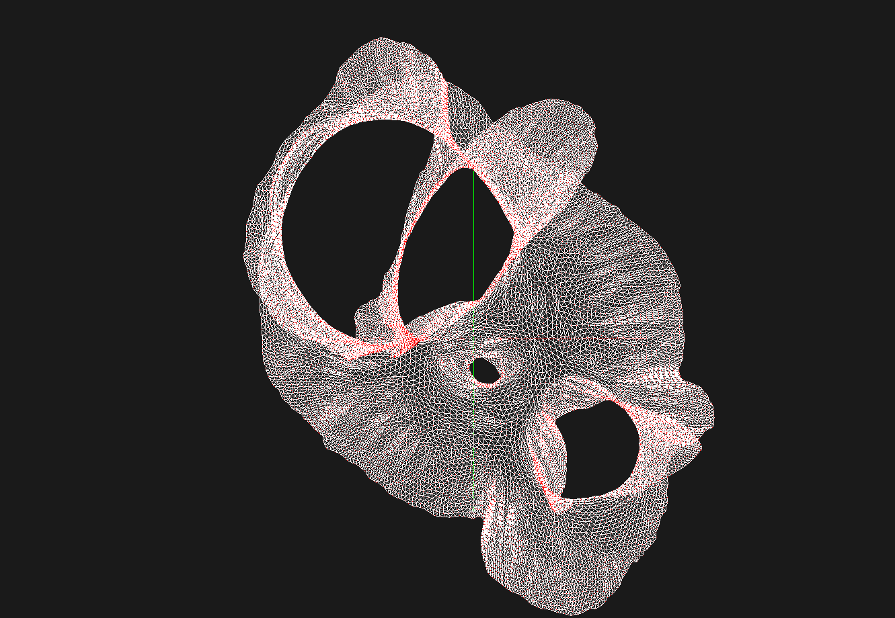
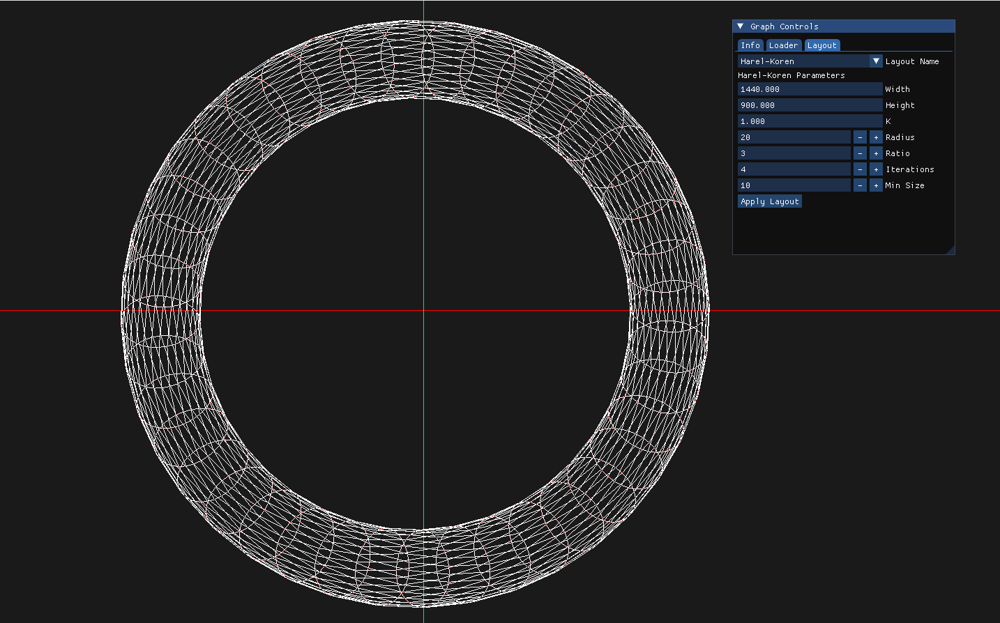
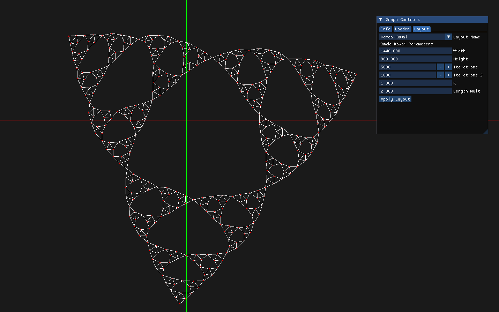

# Graph Layouts

Implementation of graph layout algorithms and a minimal GUI used to visualize layouts and experiment with algorithm parameters.

## Layout Algorithms

- [x] Fruchterman–Reingold
    - [ ] Grid Optimization
- [x] Kamada–Kawai
- [x] Eades
- [x] Harel-Koren
- [ ] Walshaw

## Build & Run

```bash
make buildAll
make
```

## Example






## References
- D. Harel, Y. Koren.
  *A Fast Multi-Scale Method for Drawing Large Graphs*.

- T. Kamada, S. Kawai.
  *An Algorithm for Drawing General Undirected Graphs*.

- T. M. J. Fruchterman, E. M. Reingold.
  *Graph Drawing by Force-Directed Placement*.

- C. Walshaw.
  *A Multilevel Algorithm for Force-Directed Graph Drawing*.
